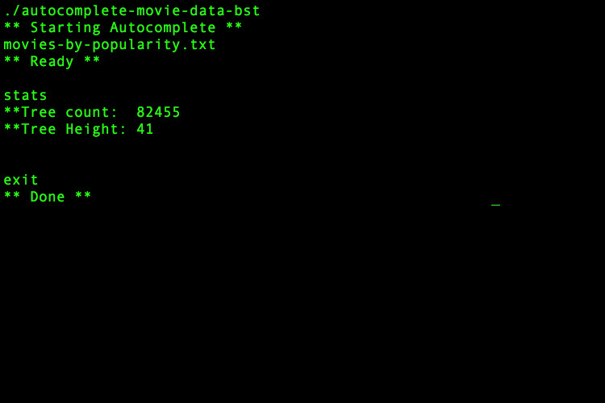
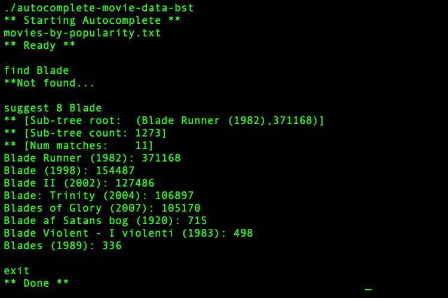
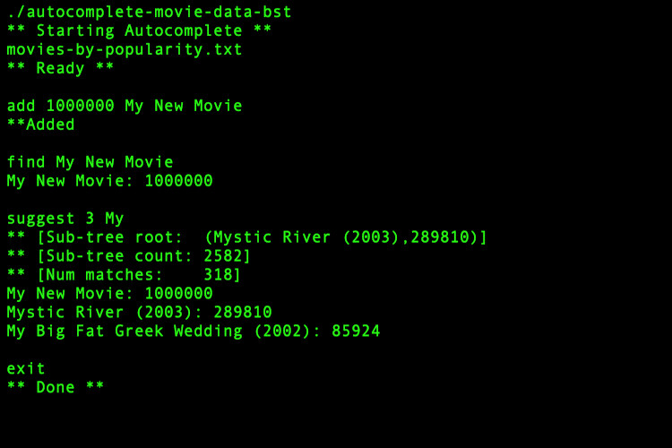

# autocomplete-movie-data-bst
Search Movie Data Stored in BST Using Autocomplete
***
Created by Alex Viznytsya, Spring 2017

## Project Description:

This application implements “auto-complete”. This is a feature we use every day, where we enter a partially complete piece of text and the system suggests various ways to complete. The “internet movie database” offers this feature to help find movies.

Given an input file of textual phrases and weights, the user can ask the system to suggest "K" ways to complete the given piece of text, in decreasing order by weight. In the example shown below, we are telling the program to read the phrases and weights from the input file “movies-by-popularity.txt”, and then to suggest the top 10 ways to complete the textual phrase “A Beautif”. Only 3 ways are shown because there are only 3 matches in the given input file; the integers shown to the right of the movie name are the weights (in this case the # of votes cast for this movie on the IMDB site).

#### User can enter 5 different commands:

1. stats - outputs the # of nodes in the tree, followed by the height.
2. find **_phrase_** - searches the tree for an exact match to the phrase input by the user; if found, the phrase and weight are output, otherwise “**Not found...” is output.
3. add **_weight phrase_** - inserts a new node into the tree with the given phrase and weight; if the insert is successful then “**Added” is output, otherwise “**Not added...” is output.
4. suggest **_k phrase_** - auto-complete command. Where k is the maximum number of suggested movies searched with given phrase.
5. exit

#### Examples of running program:

